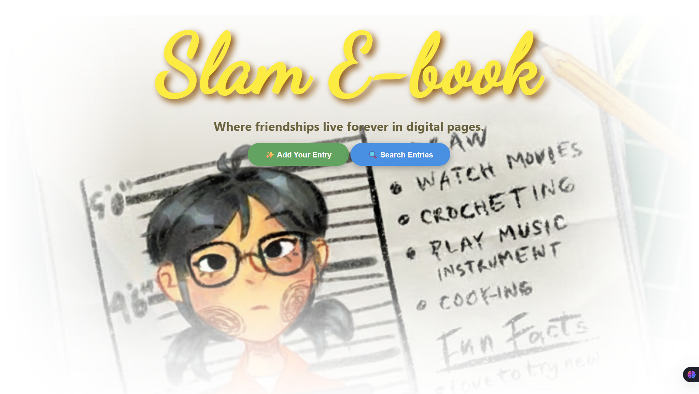
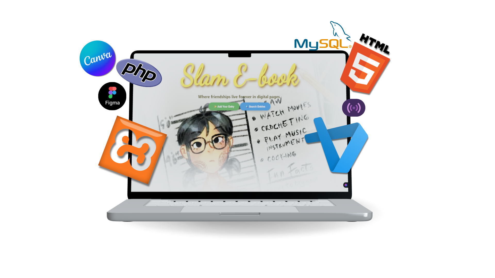
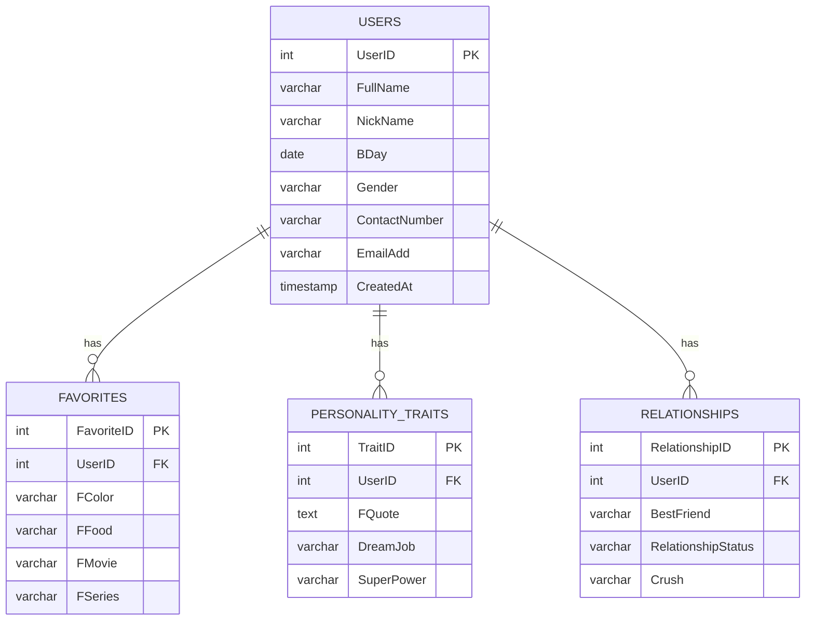
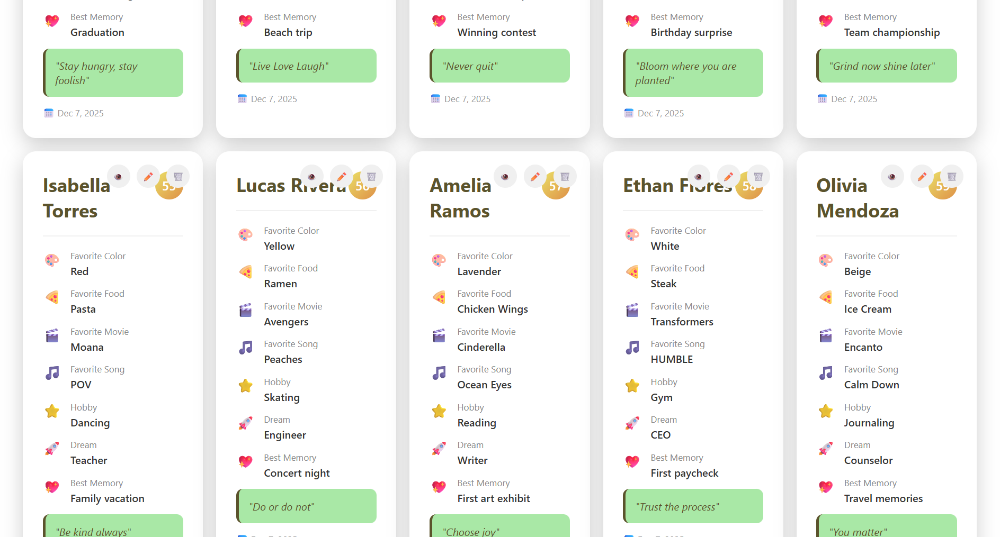
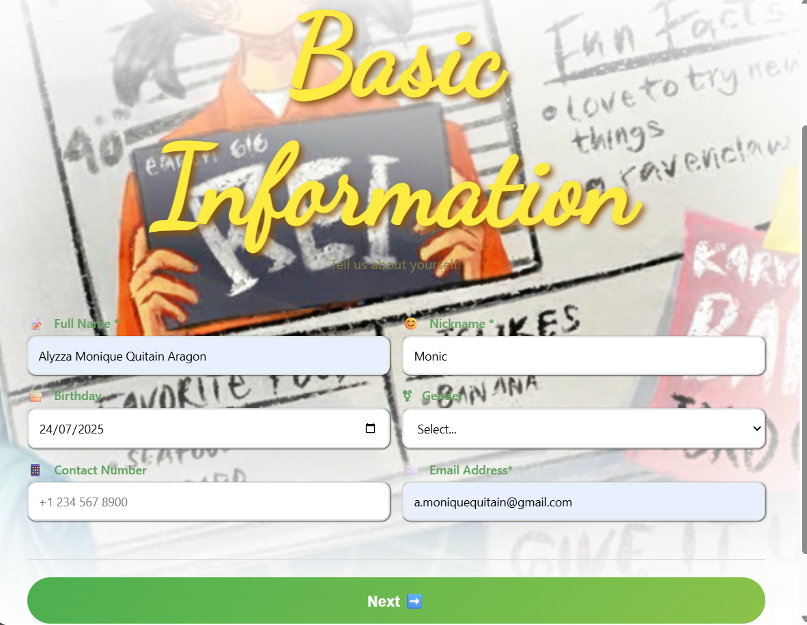
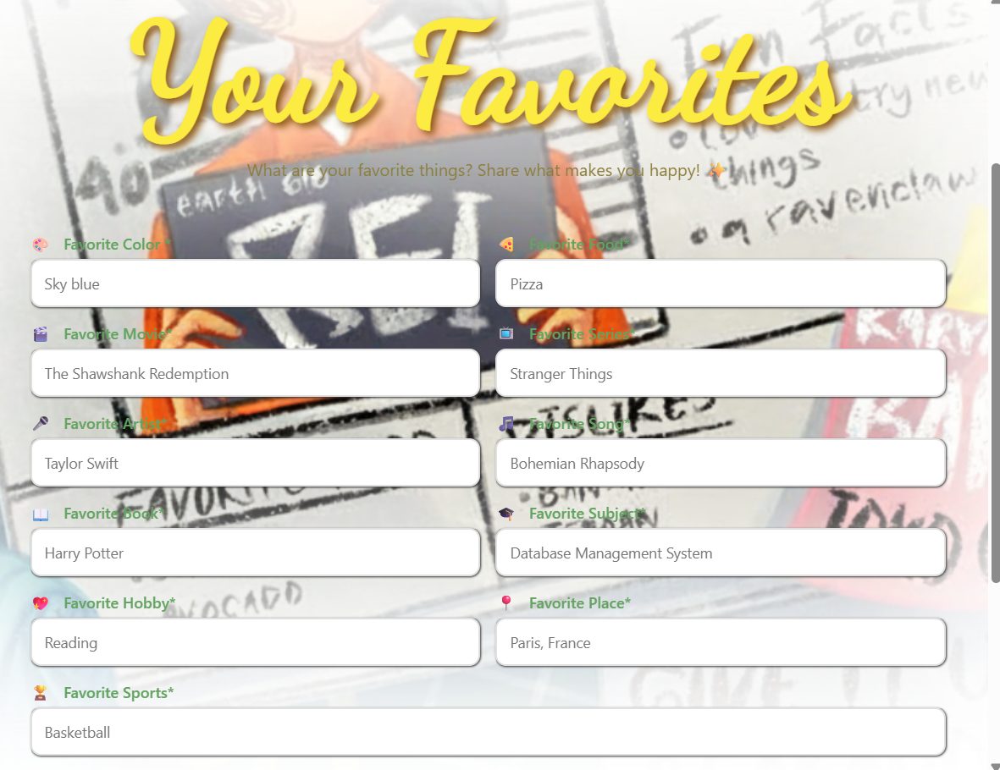
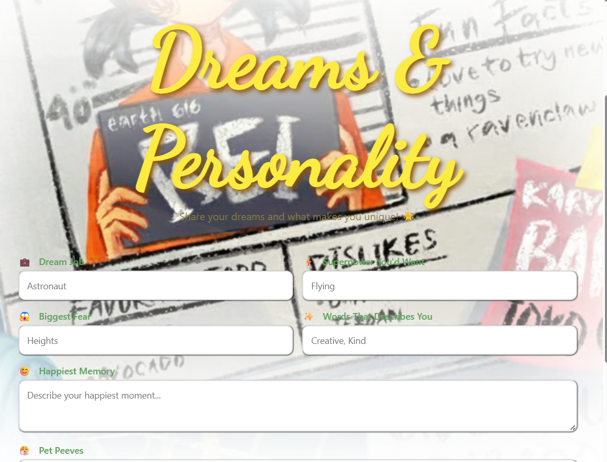
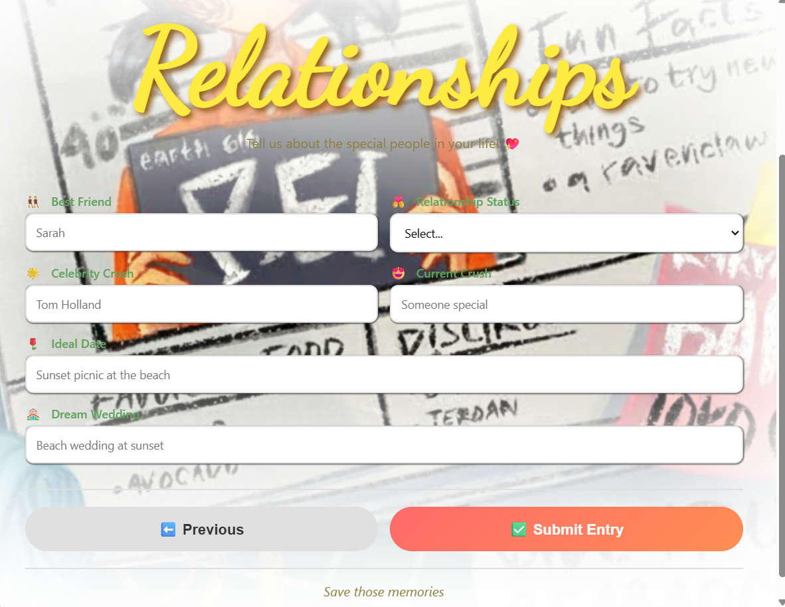
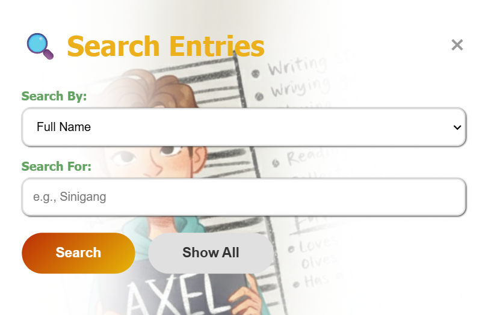

# SLAM E-BOOK

<div align="center">



**Where friendships live forever in digital pages** ✨

[](https://github.com/yourusername/slam-ebook)
[](https://www.php.net/)
[](https://www.mysql.com/)
[](https://html.spec.whatwg.org/)

---

**Final Requirement - IT 211: Database Management System**  
Computer Science Department | 1st Semester AY 2025-2026

**Developer:** Aragon, Alyzza Monique Q.  
**Section:** CS-2101

</div>

---

# OVERVIEW

**SLAM E-BOOK** transforms the traditional handwritten slambook into a modern digital platform designed for today's students and teenagers. This nostalgic yet innovative system allows users to:

- 💭 Express themselves freely and authentically
- 📝 Document unforgettable memories
- 🤝 Connect with peers in meaningful ways
- 🎨 Showcase their unique personality
- 🔐 Store information securely in a database

> 🎯 **Mission:** Create an organized, lasting medium for students to share personal stories, connect with friends, and build their digital identity beyond fleeting social media posts.

---

# OBJECTIVES

This project was developed to:

1. ✅ Create a **well-designed relational database** integrated with a user-friendly GUI
2. ✅ Apply **MySQL knowledge** for CRUD Operations and Database Integration
3. ✅ Demonstrate mastery of **MySQL aggregation functions** and data analysis queries

---

# FEATURES

### 🔧 Core Functionality

| Feature | Description | Icon |
|---------|-------------|------|
| **CREATE** | Easy entry creation with multi-step form wizard | ➕ |
| **READ** | Search and view entries by any field | 🔍 |
| **UPDATE** | Modify existing entries seamlessly | ✏️ |
| **DELETE** | Remove entries with confirmation | 🗑️ |
| **ANALYTICS** | View statistics and insights | 📊 |

### 🎨 User Experience

- ✨ **Clean & Playful Interface** - Modern design with nostalgic vibes
- 🎯 **Intuitive Navigation** - Easy to use for all age groups
- 📱 **Responsive Design** - Optimized for desktop viewing
- 🔒 **Secure Storage** - All data safely stored in MySQL database
- ⚡ **Fast Performance** - Quick data retrieval and updates

---

# TECH STACK


<div align="center">

| Technology | Purpose | Badge |
|------------|---------|-------|
| **HTML5** | Frontend structure and UI components |  |
| **PHP** | Backend API and database operations |  |
| **MySQL** | Database management system |  |
| **XAMPP** | Local development environment |  |
| **VSCode** | Code editor and development |  |
| **Figma** | UI/UX design |  |
| **Canva** | Graphics and image editing |  |

</div>

### 💻 Hardware

- **Laptop:** Huawei Matepad 16
- **Processor:** Intel Core i5

---

# DATABASE DESIGN

### 📊 Database Schema

The database consists of **4 normalized tables** following 3NF principles:

```
USERS (Central Table)
  └── UserID [PK]
      ├── FAVORITES [FK]
      ├── PERSONALITY_TRAITS [FK]
      └── RELATIONSHIPS [FK]
```

### 📋 Tables Overview

#### 1️⃣ USERS Table
**Purpose:** Central table storing basic user information

| Field | Type | Constraints | Description |
|-------|------|-------------|-------------|
| `UserID` | INT(11) | PRIMARY KEY, AUTO_INCREMENT | Unique identifier |
| `FullName` | VARCHAR(100) | NOT NULL | User's full name |
| `NickName` | VARCHAR(50) | NOT NULL | Preferred nickname |
| `BDay` | DATE | NULL | Date of birth |
| `Gender` | VARCHAR(20) | NULL | Gender identity |
| `ContactNumber` | VARCHAR(50) | NULL | Phone number |
| `EmailAdd` | VARCHAR(150) | NULL | Email address |
| `CreatedAt` | TIMESTAMP | NOT NULL, DEFAULT | Entry creation timestamp |

#### 2️⃣ FAVORITES Table
**Purpose:** Stores user's favorite things

| Field | Type | Description |
|-------|------|-------------|
| `FavoriteID` | INT(11) | Unique identifier |
| `UserID` | INT(11) | Foreign key reference |
| `FColor` | VARCHAR(25) | Favorite color 🎨 |
| `FFood` | VARCHAR(25) | Favorite food 🍕 |
| `FMovie` | VARCHAR(50) | Favorite movie 🎬 |
| `FSeries` | VARCHAR(50) | Favorite series 📺 |
| `FArtist` | VARCHAR(50) | Favorite artist 🎤 |
| `FSong` | VARCHAR(50) | Favorite song 🎵 |
| `FBook` | VARCHAR(100) | Favorite book 📚 |
| `FSubject` | VARCHAR(50) | Favorite subject 📖 |
| `FHobby` | VARCHAR(100) | Favorite hobby 🎯 |
| `FPlace` | VARCHAR(100) | Favorite place 🌍 |
| `FSports` | VARCHAR(100) | Favorite sports ⚽ |

#### 3️⃣ PERSONALITY_TRAITS Table
**Purpose:** Captures personality and aspirations

| Field | Type | Description |
|-------|------|-------------|
| `TraitID` | INT(11) | Unique identifier |
| `UserID` | INT(11) | Foreign key reference |
| `FQuote` | TEXT | Favorite quote 💬 |
| `DreamJob` | VARCHAR(200) | Career aspirations 💼 |
| `SuperPower` | VARCHAR(150) | Desired superpower 🦸 |
| `BiggestFear` | VARCHAR(200) | Greatest fear 😰 |
| `HappiestMemory` | TEXT | Happiest moment 😊 |
| `PetPeeves` | TEXT | Pet peeves 😤 |
| `WordsThatDescribesYou` | VARCHAR(150) | Self-description 🏷️ |

#### 4️⃣ RELATIONSHIPS Table
**Purpose:** Stores relationship information

| Field | Type | Description |
|-------|------|-------------|
| `RelationshipID` | INT(11) | Unique identifier |
| `UserID` | INT(11) | Foreign key reference |
| `BestFriend` | VARCHAR(150) | Best friend 👯 |
| `RelationshipStatus` | VARCHAR(50) | Current status 💑 |
| `CelebrityCrush` | VARCHAR(150) | Celebrity crush ⭐ |
| `IdealDate` | VARCHAR(200) | Perfect date scenario 🌹 |
| `DreamWedding` | VARCHAR(200) | Dream wedding 💒 |
| `Crush` | VARCHAR(150) | Current crush 💖 |

---

# ENTITY-RELATIONSHIP DIAGRAM


---

# INSTALLATION

### Prerequisites

Before you begin, ensure you have:

- ✅ **XAMPP** installed (Apache + MySQL)
- ✅ **Modern web browser** (Chrome, Edge, Firefox)
- ✅ **Text editor** (VSCode recommended)

### 📥 Setup Steps

1. **Clone the repository**
   ```bash
   git clone https://github.com/yourusername/slam-e-book.git
   cd slamebook
   ```

2. **Start XAMPP services**
   - Open XAMPP Control Panel
   - Start **Apache** server
   - Start **MySQL** server

3. **Import database**
   - Open `http://localhost/phpmyadmin`
   - Create new database: `aragon_slamebookdb`
   - Import SQL file: `database/aragon_slamebookdb.sql`

4. **Configure database connection**
   ```php
   // config.php
   $host = "localhost";
   $username = "root";
   $password = "";
   $database = "aragon_slamebookdb";
   ```

5. **Access the application**
   ```
   http://localhost/slamebook/index.html
   ```

### ⚙️ System Requirements

| Requirement | Specification |
|-------------|---------------|
| 🌐 **Browser** | Chrome, Edge (latest version) |
| 💻 **OS** | Windows, macOS, Linux |
| 🔌 **Server** | XAMPP (PHP 7.4+, MySQL 5.7+) |
| 📱 **Display** | Desktop only |

---

# USER'S GUIDE

### 🏠 Home Page

When you first access SLAM E-BOOK, you'll see:




- 🎨 **Clean Header** with application branding
- 💫 **Tagline**: "Where friendships live forever in digital pages"
- ➕ **Add Your Entry** button
- 🔍 **Search Entries** button
- 📋 **Entry Cards Grid** displaying all entries

---

### ➕ Adding a New Entry

Create a complete profile in **4 easy steps**:

<details>
<summary><b>Step 1: Personal Information</b> 👤</summary>



Enter your basic details:
- Full Name *
- Nickname *
- Birthday
- Gender
- Contact Number
- Email Address

*Required fields
</details>

<details>
<summary><b>Step 2: Favorite Things</b> ⭐</summary>



Share your favorites:
- 🎨 Favorite Color
- 🍕 Favorite Food
- 🎬 Favorite Movie
- 📺 Favorite Series
- 🎤 Favorite Artist
- 🎵 Favorite Song
- 📚 Favorite Book
- 📖 Favorite Subject
- 🎯 Favorite Hobby
- 🌍 Favorite Place
- ⚽ Favorite Sports
</details>

<details>
<summary><b>Step 3: Dreams & Personality</b> 💭</summary>



Express yourself:
- 💬 Favorite Quote
- 💼 Dream Job
- 🦸 Superpower (if you could have one)
- 😰 Biggest Fear
- 😊 Happiest Memory
- 😤 Pet Peeves
- 🏷️ Words That Describe You
</details>

<details>
<summary><b>Step 4: Relationships</b> 💕</summary>



Share your connections:
- 👯 Best Friend
- 💑 Relationship Status
- ⭐ Celebrity Crush
- 🌹 Ideal Date
- 💒 Dream Wedding
- 💖 Crush
</details>

---

### 🔍 Searching Entries

Find entries quickly using the powerful search feature:



**Search by categories:**
- 👤 **Personal Info** - Name, nickname, gender
- ⭐ **Favorites** - Colors, foods, movies, etc.
- 💭 **Personality** - Dream job, superpower, fears
- 💕 **Relationships** - Best friend, crush, status

---

### 👁️ Viewing Entry Details

Click any entry card to view complete information:
**Available actions:**
- ✏️ **Edit Button** - Switch to edit mode
- ❌ **Close** - Return to main page

---

### ✏️ Editing an Entry

Update any information easily:
**What you can modify:**
- Personal information
- All favorite preferences
- Personality traits and memories
- Relationship information

💾 Click **"Submit Entry"** to save changes!

---

### 🗑️ Deleting an Entry

Remove entries with confirmation:
**⚠️ Important:**
- You'll be asked to confirm deletion
- This action **cannot be undone**
- All associated data will be permanently removed

---

### 📊 Analytics & Reports

View comprehensive statistics and insights:
**Available reports:**
- 📈 Total user count
- 📞 Users with contact information
- 👥 Gender distribution
- 💑 Relationship status breakdown
- 🆕 Recent 5 entries
- 📊 User statistics:
  - Total users
  - Male/Female count
  - Average age
  - Contacts available
  - Oldest/Youngest birthday
- ⭐ Popular preferences
- ✅ Profile completion scores

---

## 📸 Screenshots

### 🎨 Main Interface

<div align="center">


</div>

### 📝 Multi-Step Form

<div align="center">


</div>

### 🔍 Search & Filter

<div align="center">


</div>

---

# REFLECTION

#### 💡 Key Learnings

1. **Database Design** 
   - Creating the database structure in XAMPP/MariaDB was straightforward thanks to DBMS coursework
   - Learned to properly implement relationships and constraints

2. **Backend Integration** 
   - The real challenge: integrating database with PHP API
   - Fascinating to see how SQL commands translate to API operations
   - Gained appreciation for full-stack development

3. **Frontend Development** 
   - Focused heavily on user experience
   - Carefully selected color schemes and fonts
   - Aimed for "playful yet professional" aesthetic

#### 🚀 Future Goals

This project has:
- Enhanced my technical skills in database management
- Strengthened my web development abilities
- Reinforced the importance of user-centered design
- Inspired me to pursue more projects in this field

> 💖 **"This project not only met academic requirements but also created a meaningful platform for young users to express themselves and connect with peers."**

---

# LICENSE

This project was created as a final requirement for **IT 211: Database Management System** at Batangas State University.

**Academic Use Only** - This is a student project for educational purposes.

---

# AUTHOR

**Aragon, Alyzza Monique Q.**  
Computer Science Student | Batangas State University  
Section: CS-2101

---

# ACKNOLEDGEMENTS

Special thanks to:

- 🏫 **Batangas State University** - College of Informatics and Computing Sciences
- 👨‍🏫 **Ms. Jenny Rose C. Mendoza** - For guidance and support
- ❤️ **Family & Friends** - For continuous support and feedback for the betterment of the system
